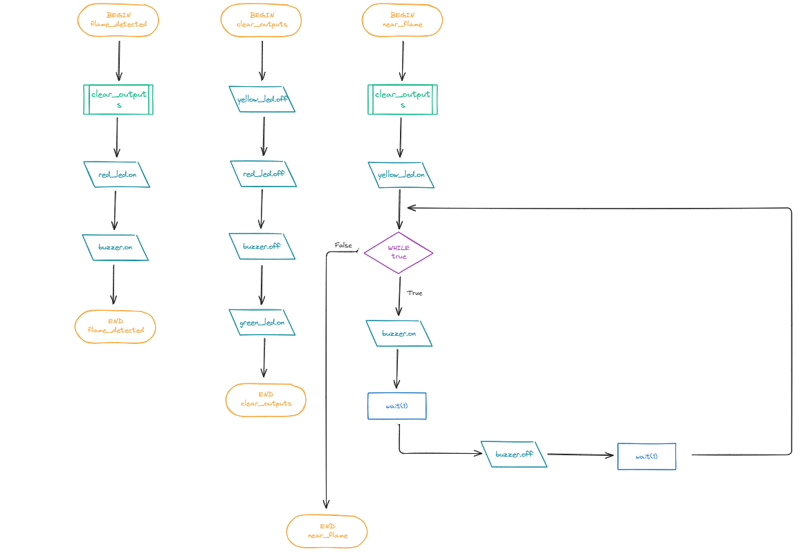
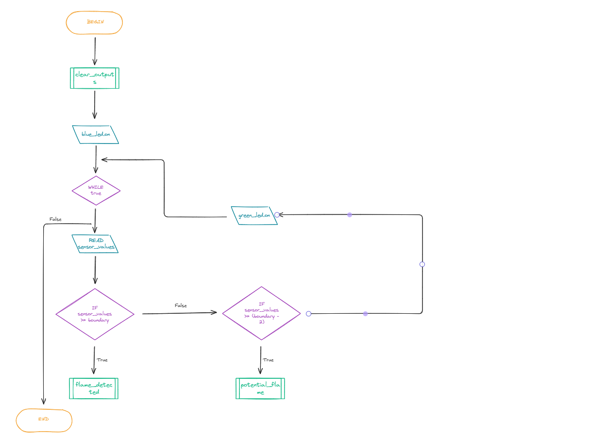

# MECHATRONICS PROJECT DOCUMENTATION

## Requirements Outline

### Defining the Purpose

Fires can be unpredictable, highly dangerous, and unnoticeable until it's too late. However, one of the most effective ways to warn anyone of an incoming fire are smoke & fire alarms. I will design an alarm that uses a sensor to detect flames (smoke and heat) and turn on both an LED (visual warning) and buzzer (auditory warning) if any dangerous amounts of smoke and/or heat is detected, alerting anyone in the vicinity.

### Key Actions

* Green LED remains on if nothing is detected.
* Blue LED remains on as long as the machine is on.
* Red LED starts remains on, buzzer starts playing, and Green LED turns off if a fire is detected.

### Functional Requirements

* **Power Detection & Alerts**: If the machine is powered on, the Blue LED also stays on (so that users are aware the alarm is powered).
* **Fire Detection & Alerts**: If the sensor values are above boundary (have yet to determine), Red LED turns on and buzzer starts continuously buzzing.
* **Neutral and Warning Alerts**: If the sensor values are within the boundary, Green LED turns on and stays on. If the sensor values are within but less than 2 degrees/values off the boundary, a Yellow LED turns on and the buzzer starts buzzing off and on.

### Non-Functional Requirements

* **Response Time**: The machine should respond as fast as possible without compromising the functionality of the code. Every 100-500 milliseconds should do (is this too overkill?)
* **False Alarm Button**: In case of a false alarm, a button can be pressed that will mute the machine for 20 seconds. If it still keeps detecting flames, it will continue buzzing after the 20 seconds. There would be a one minute cooldown between button presses (meaning 40 seconds of true fire alerts with buzzing between them), and the Red LED will still continue flashing throughout the false alarm.

### Test Cases

| Test Case | Input | Expected Result |
|-----------|-------|-----------------|
| There is currently no fire | Flame sensor detects values within boundary | Green LED turns on |
| A fire might start | Flame sensor detects value at most 2 values short of boundary | Yellow LED turns on and buzzer starts buzzing off and on |
| Machine is plugged in | Machine gains power | Blue LED turns on |
 
## Algorithms

### Pseudocode
```
BEGIN clear_outputs()  
    yellow_led.off  
    red_led.off  
    green_led.off  
    buzzer.off  
END clear_outputs()  
  
BEGIN flame_detected()  
    clear_outputs()  
    red_led.on  
    buzzer.on  
END flame_detected()  
  
BEGIN potential_flame()  
    clear_outputs()  
    yellow_led.on  
    WHILE true THEN  
        buzzer.on  
        wait(1)  
        buzzer.off  
        wait(1)  
    ENDWHILE  
END potential_flame()  
  
BEGIN  
clear_outputs()  
blue_led.on  
    WHILE true THEN  
        READ sensor_values  
        IF sensor_values >= boundary  
            flame_detected()  
        ELSE THEN  
            IF sensor_values >= (boundary - 2) THEN  
                potential_flame()  
            ELSE THEN  
            green_led.on  
            ENDIF  
        ENDIF  
    ENDWHILE  
END
```
### Flowcharts




## Design

## Development and Integration

## Testing and Debugging

### Test Case 1: Receiving Sensor Values

**14/08** - Test case failed miserably. Turns out I have no idea how to wire it up - all I know is that Ground goes into the negative output (I did some circuit stuff in Engineering), but it makes no sense because there are *four pins* - a positive one (pretty easy), a ground one, a DO pin (???) and AO (???).

```

from machine import Pin # this is where you control inputs and outputs in a Pico
import time
sensor_pin = ADC(26) """This pin is connected to the ground pin of the pico"""

"""Gonna try to test the flame sensor here.
Hopefully it works, I need to see what values they hold"""

sensor_values = sensor_pin.read_u16()				"""I'm pretty sure this receives sensor values?"""
print(sensor_values)

"""while True:
    sensor_value = sensor_pin.read_u15()	# Supposed to read the value the sensor receives
    print(sensor_value)
    time.sleep(0.5)"""
```

**18/08** - Finally figured out that AO and DO stand for analog and digital inputs. Me and my partner did some testing and THE WIRING FINALLY WORKS - we finally got some values from the sensor!

### Test Case 2: Blue LED On Upon Machine On

**18/08** - Did it first try. It was much easier than I expected.

## Evaluations

### Peer Eval

### Final Eval